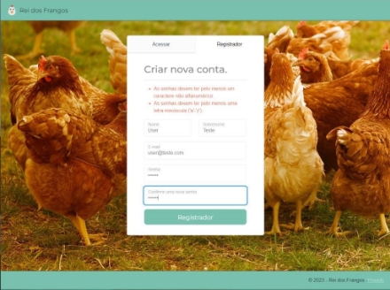

## 9- DESENVOLVIMENTO DO BACKEND REI DOS FRANGOS

​	O sistema backend do Rei dos Frangos foi cuidadosamente desenvolvido utilizando a linguagem de programação C# e adotando a arquitetura padrão Model- View-Controller (MVC). Essa escolha proporciona uma organização estruturada do código, facilitando a manutenção e escalabilidade do sistema. Além disso, o banco de dados SQLite foi adotado para armazenar os dados de forma eficiente e confiável, pois se trata de uma ferramenta leve e incorporada oferecendo vantagens em termos de simplicidade, desempenho e portabilidade. A combinação dessas tecnologias proporciona ao Rei dos Frangos uma base sólida e eficaz, garantindo um sistema robusto, fácil de manter e capaz de atender às demandas operacionais de maneira eficiente.

​	No contexto da autenticação no sistema Rei dos Frangos, o processo requer a prévia criação de um usuário, conforme ilustrado na figura 40. Tal procedimento demanda a inserção de informações essenciais, tais como nome, sobrenome, email e uma senha alfanumérica. O sistema verifica se todos os campos estão preenchidos e se a senha atende aos requisitos de segurança. Se um campo estiver vazio ou não atendenda aos requisitos, será exibida uma mensagem informando o erro.

​	A Figura 41 apresenta a interface de autenticação do sistema, o usuário é solicitado a inserir as credenciais previamente cadastradas, compreendendo o email e a senha. Ao acionar o botão de login, a plataforma realiza uma verificação para assegurar a validade dos dados fornecidos. No caso de correspondência, o usuário é então autenticado e recebe a autorização para acessar o sistema.

​	Por meio da Figura 42, é possível observar a home page do site Rei dos Frangos, que se configura como uma listagem de todas as granjas pertencentes à empresa. Nessa interface, os usuários têm acesso a informações cruciais, como o nome da granja, o estado e município nos quais ela está localizada, além do seu sistema de produção. Destaca-se que, além de uma visualização informativa, os usuários contam com a capacidade de interação direta com a plataforma. Essa interatividade permite abrir a interface para cadastrar uma nova granja, editar informações das granjas já existentes e, inclusive, excluir registros, proporcionando uma administração eficiente e personalizada do conjunto de granjas cadastradas no sistema.

​	Como evidenciado na Figura 43, para efetuar o cadastro de uma nova granja, é imprescindível fornecer informações específicas, tais como o nome da granja, o estado e município nos quais está localizada, e o sistema de reprodução adotado. Este processo visa garantir a precisão e a completude dos dados associados a cada granja, contribuindo para uma gestão eficaz e organizada das informações dentro do sistema.

​	Em síntese, a análise das funcionalidades e interfaces apresentadas anteriormente revela a robustez e a praticidade do sistema desenvolvido para a empresa Rei dos Frangos. A página inicial, destacada na Figura 42, proporciona uma visão abrangente e informativa de todas as granjas, possibilitando aos usuários acesso a informações cruciais e a interação direta com a plataforma. Já a Figura 43 detalha o processo de cadastro de uma nova granja, enfatizando a necessidade de fornecer informações essenciais para manter a integridade do sistema. A conjugação dessas funcionalidades visa oferecer uma experiência de gestão eficiente e personalizada, contribuindo para a eficácia operacional da empresa Rei dos Frangos.

## 10 - POLÍTICAS DE SEGURANÇA

1\. INTRODUÇÃO

A Empresa Agropecuária Rei do Frango, sediada em Belo Horizonte e com

três fazendas estrategicamente localizadas em Viçosa, Uberaba e Uberlândia,

reconhece a importância crucial da segurança da informação e da infraestrutura

de rede para garantir o sucesso de suas operações. Nesse contexto, a

implementação de uma Política de Segurança da Rede torna-se imperativa para

atender às crescentes necessidades de comunicação e conectividade entre

esses quatro locais geograficamente dispersos.

O desenvolvimento do Protótipo da Rede no Simulador Cisco Packet Trace,

adotando a topologia em estrela, representa um passo significativo na busca pela

eficiência operacional, segurança e escalabilidade. A distribuição cuidadosa de

IPs, estruturada com base nas funções dos dispositivos em cada local, estabelece

uma base sólida para o intercâmbio seguro de dados e informações cruciais para

as operações diárias.

A inclusão da virtualização local, com a simulação de serviços on-premises

através de um servidor virtualizado, e a implantação na nuvem AWS, conectando

servidores locais e na nuvem, demonstram a abordagem inovadora e adaptável

da Empresa Rei do Frango às demandas tecnológicas em constante evolução.

Essa estratégia híbrida não apenas proporciona flexibilidade, mas também

assegura a continuidade operacional em diferentes cenários.

O monitoramento proativo dos ambientes de rede através do Zabbix,

utilizando SNMP para coletar dados de dispositivos, representa um compromisso

com a segurança e a integridade da infraestrutura. Essa abordagem preventiva,

aliada à capacidade de resposta rápida a eventos adversos, reflete o empenho

da empresa em manter um ambiente de rede seguro e confiável.

Em síntese, este projeto de Política de Segurança da Rede visa garantir

eficiência operacional, segurança robusta e escalabilidade, atendendo às

 

necessidades específicas de cada localidade da empresa Rei do Frango. O uso

integrado de tecnologias locais e em nuvem, combinado com um monitoramento

contínuo, contribui para uma infraestrutura de rede resiliente e adaptável, pronta

para enfrentar os desafios dinâmicos do ambiente empresarial atual.

2\. OBJETIVO

O objetivo primordial da Política de Segurança da Empresa Agropecuária Rei

do Frango é estabelecer diretrizes e práticas que assegurem a confidencialidade,

integridade, disponibilidade e autenticidade das informações e sistemas críticos

da organização. Esta política visa garantir a proteção efetiva contra ameaças

cibernéticas, preservando a continuidade operacional, promovendo a

conformidade com regulamentações vigentes e cultivando uma cultura de

segurança entre todos os colaboradores.

Para alcançar esse objetivo, a política concentra-se nos seguintes pontos:

Proteção dos Ativos de Informação: Salvaguardar ativos de informação, incluindo

dados sensíveis e sistemas críticos, por meio da implementação de controles de

acesso, criptografia e outras medidas de segurança apropriadas.

Gestão de Acessos: Garantir que o acesso aos recursos de tecnologia da

informação seja concedido de maneira criteriosa, baseado em princípios de

necessidade mínima e atribuição de privilégios de acordo com as

responsabilidades dos colaboradores.

Monitoramento e Detecção de Ameaças: Implementar sistemas de

monitoramento contínuo, como o Zabbix, para identificar precocemente

atividades suspeitas, ataques cibernéticos e outras ameaças à segurança da

rede.

Políticas de Uso Aceitável: Estabelecer regras claras e diretrizes para o uso

apropriado dos recursos de tecnologia da informação, promovendo a

conscientização dos colaboradores sobre boas práticas de segurança.

Gestão de Incidentes: Desenvolver e manter um plano abrangente de gestão de

incidentes, definindo procedimentos para resposta rápida e eficaz a eventos de

segurança, minimizando o impacto e prevenindo recorrências.

Atualizações e Patching: Assegurar que todos os sistemas e softwares sejam

regularmente atualizados e que as vulnerabilidades sejam corrigidas de maneira

oportuna, reduzindo assim o risco de exploração.

Conformidade com Regulamentações: Manter conformidade com leis,

regulamentos e padrões aplicáveis relacionados à segurança da informação,

garantindo transparência e responsabilidade da empresa.

Educação e Treinamento em Segurança: Fomentar uma cultura de segurança por

meio de programas regulares de treinamento e conscientização, capacitando os

colaboradores a reconhecer e mitigar ameaças potenciais.

Ao alinhar esses objetivos com as características específicas da infraestrutura

de rede implementada, a Empresa Rei do Frango busca construir uma postura de

segurança resiliente e adaptável, capaz de enfrentar os desafios em constante

evolução no cenário de ameaças cibernéticas.

3\. ABRANGÊNCIA

Esta política se aplica a todos os colaboradores, prestadores de serviços,

sistemas de informação, dispositivos e recursos relacionados à infraestrutura de

rede da Empresa Agropecuária Rei do Frango. Abrange todas as operações

realizadas nas instalações principais em Belo Horizonte e nas fazendas

localizadas em Viçosa, Uberaba e Uberlândia.

A abrangência inclui, mas não se limita a:

**Colaboradores:** Todos os funcionários, terceirizados, estagiários e qualquer

outra entidade que tenha acesso aos sistemas de informação e recursos da

empresa.

**Instalações:** Todas as instalações físicas da Empresa Agropecuária Rei do

Frango, incluindo escritórios administrativos, centros de processamento de

dados, e fazendas em Viçosa, Uberaba e Uberlândia.

**Sistemas de Informação:** Todos os sistemas, servidores, bancos de dados,

aplicativos e plataformas tecnológicas utilizadas para processar, armazenar e

transmitir informações.

**Redes de Comunicação:** A infraestrutura de rede, incluindo equipamentos de

rede, roteadores, switches, firewalls e outros dispositivos utilizados para facilitar

a comunicação entre as instalações.

**Dispositivos de Usuários Finais:** Todos os dispositivos de propriedade da

empresa ou utilizados por colaboradores para acessar os sistemas da

organização, como computadores, laptops, tablets e smartphones.

**Serviços em Nuvem:** Todos os serviços em nuvem utilizados pela empresa,

como os fornecidos pela AWS, que estão integrados à infraestrutura de rede.

 

**Processos de Negócios:** Todos os processos operacionais, incluindo aqueles

relacionados à produção, logística, recursos humanos, finanças e outras áreas

funcionais, que dependem de sistemas de informação e infraestrutura de rede.

Esta política se estende a qualquer atividade realizada nos locais mencionados

acima, seja por funcionários internos, contratados ou visitantes, com o objetivo

de promover uma cultura de segurança da informação e proteger os ativos

críticos da Empresa Agropecuária Rei do Frango contra ameaças cibernéticas e

garantir a conformidade com regulamentações aplicáveis.

4\. DIRETRIZES GERAIS

**4.1Interpretação**

**4.1.1 Terminologia e Definições**

Para uma interpretação uniforme desta Política de Segurança da Empresa

Agropecuária Rei do Frango (PSERF), são adotadas as siglas, termos e definições

especificadas no Apêndice A deste documento.

**4.1.2 Restrição de Interpretação**

Esta PSERF deve ser interpretada de forma restritiva. Em situações excepcionais

ou não contempladas por suas disposições, a realização de atividades específicas

somente é permitida mediante prévia e expressa autorização da Empresa.

**4.1.2.1 Exceções e Autorizações Pontuais**

Qualquer caso excepcional ou permissão diferenciada será concedido de forma

pontual, aplicável exclusivamente ao solicitante, dentro dos limites e motivos que

fundamentaram a solicitação. A aprovação destas exceções é uma prerrogativa

da Empresa Agropecuária Rei do Frango e ocorrerá por mera liberalidade, com

duração limitada. A Empresa reserva-se o direito de revogar tal autorização a

qualquer momento, sem necessidade de aviso prévio, caso julgue necessário.

Estas diretrizes visam garantir uma interpretação consistente da PSERF, ao

mesmo tempo em que proporcionam flexibilidade controlada para lidar com

circunstâncias excepcionais que possam surgir durante a implementação e

execução das medidas de segurança.

 

**4.2 Propriedade**

**4.2.1 Propriedade e Direito de Uso Exclusivos:**

Todas as informações geradas, acessadas, recebidas, manuseadas ou

armazenadas pela Empresa Agropecuária Rei do Frango, assim como a

reputação, a marca, o conhecimento e demais ativos tangíveis e intangíveis, são

de propriedade exclusiva de cada unidade.

**4.2.2 Recursos de TIC para Atividades Operacionais:**

Os recursos de Tecnologia da Informação e Comunicação (TIC) fornecidos pela

Empresa Agropecuária Rei do Frango para o desenvolvimento de atividades

operacionais, em todas as suas localidades, são de propriedade de cada unidade

ou estão a ela cedidos. Permanecem sob sua guarda e posse, devendo ser

utilizados exclusivamente para o cumprimento da finalidade a que se propõem.

**4.2.3 Uso Restrito a Atividades Profissionais:**

Todos os ativos tangíveis e intangíveis da Empresa Agropecuária Rei do Frango

só podem ser utilizados para o cumprimento das atividades profissionais,

limitados à função do colaborador.

**4.2.4 Utilização de Marcas e Identidade Visual:**

A utilização das marcas, identidade visual e demais sinais distintivos da Empresa

Agropecuária Rei do Frango, atuais e futuros, em qualquer veículo de

comunicação, incluindo internet e mídias sociais, só pode ocorrer para atender a

atividades profissionais, mediante prévia e expressa autorização.

**4.2.5 Menção à Marca em Contextos Profissionais:**

Todos os colaboradores têm o direito de fazer menção à marca em contextos

profissionais, citando o local onde trabalham. Contudo, a marca não deve ser

utilizada para criar perfis em mídias sociais em nome da instituição e/ou para

representá-la sem a devida autorização.

 

**4.2.6 Atividades Profissionais:**

Todos os recursos de TIC e informações devem ser utilizados de maneira

prioritária para o desenvolvimento de atividades profissionais, promovendo a

excelência nas operações e iniciativas relacionadas ao core business da Empresa

Agropecuária Rei do Frango.

Esta seção visa preservar a propriedade intelectual e garantir que os recursos

tecnológicos e informações sejam direcionados principalmente para atividades

profissionais, fortalecendo assim a missão operacional da empresa.

**4.3 Classificação da informação**

**4.3.3 Respeito à Classificação da Informação:**

Todos os colaboradores devem respeitar o nível de segurança indicado na

classificação das informações. Em caso de dúvida, a informação deve ser tratada

como de uso interno, sem divulgação externa, incluindo a internet e mídias

sociais, sem autorização expressa.

**4.3.4 Sigilo Profissional e Contratual:**

É fundamental que todo colaborador respeite o sigilo profissional e contratual,

abstendo-se de revelar, transferir, compartilhar ou divulgar informações

confidenciais, incluindo detalhes institucionais críticos, de outros colaboradores,

fornecedores ou prestadores de serviços.

**4.3.6 Dados Pessoais:**

Informações envolvendo dados pessoais de colaboradores devem ser tratadas

como sigilosas, utilizadas com cautela e apenas por pessoas autorizadas.

 

**4.3.7 Mecanismos de Criptografia:**

A equipe de Tecnologia da Informação (GTI) é responsável por homologar

mecanismos de criptografia, cifragem ou codificação para o armazenamento e

transmissão de conteúdos confidenciais, quando aplicáveis no desenvolvimento

de sistemas internos ou no ambiente de conectividade.

Esta seção destaca a importância do respeito à classificação e sigilo de

informações, reforçando as responsabilidades dos colaboradores na proteção de

dados confidenciais da Empresa Agropecuária Rei do Frango.

**4.4 Controle de Acesso para Colaboradores**

**4.4.1 Identidade Digital Individual:**

Cada colaborador recebe uma identidade digital individual e intransferível para

acessar fisicamente e logicamente os ambientes e recursos de Tecnologia da

Informação e Comunicação (TIC) da Empresa Agropecuária Rei do Frango.

**4.4.1.1 Monitoramento e Controle da Identidade Digital:**

A identidade digital é monitorada e controlada pela Empresa Agropecuária Rei

do Frango.

**4.4.1.2 Responsabilidade do Colaborador:**

O colaborador é responsável pelo uso e sigilo de sua identidade digital. O

compartilhamento, divulgação ou transferência não autorizados são estritamente

proibidos.

**4.4.2 Identificação nas Dependências Físicas:**

Quando a identidade é fornecida pela unidade, todos os colaboradores,

prestadores de serviços e visitantes nas dependências físicas da empresa devem

estar devidamente identificados, portando crachá individual de forma visível.

**4.4.2.1 Uso Individual do Crachá:**

O crachá de identificação é de uso individual e não pode ser compartilhado com

outros colaboradores ou terceiros, nem ser utilizado fora das dependências da

Empresa Agropecuária Rei do Frango.

 

**4.4.3 Segurança Física de Áreas Críticas:**

A empresa deve estabelecer espaços físicos seguros para proteger áreas que

criam, desenvolvem, processam ou armazenam informações críticas e ativos

essenciais, como datacenters, sala de comunicações, salas de documentação

crítica, entre outras.

**4.4.4 Proteção de Ativos Críticos:**

Ativos críticos para a empresa devem ser protegidos contra falhas de energia e

outras interrupções, além de receber manutenção adequada para garantir sua

contínua integridade e disponibilidade.

Esta seção destaca as diretrizes específicas para o controle de acesso,

garantindo a segurança física e lógica dos colaboradores na Empresa

Agropecuária Rei do Frango.

**4.5 Internet para Colaboradores**

**4.5.1 Propósito da Conectividade:**

Os recursos de conectividade são fornecidos para fins administrativos,

reconhecendo o acesso à internet como um direito essencial para o exercício da

cidadania no Brasil. No entanto, os colaboradores devem utilizar a internet em

conformidade com as leis vigentes, sendo responsáveis pelo cumprimento

dessas normas.

**4.5.2 Acesso Individual e Responsabilidade:**

O acesso à internet é concedido aos colaboradores por meio de identidade digital

(login e senha) pessoal e intransferível. O titular é o único responsável por suas

ações e/ou danos decorrentes do uso da internet.

Esta seção destaca as diretrizes específicas para o uso da internet por

colaboradores na Empresa Agropecuária Rei do Frango, ressaltando a

responsabilidade individual e a observância das leis em vigor.

 

**4.6 Correio Eletrônico para Colaboradores**

**4.6.1 Uso Profissional:**

A utilização do correio eletrônico corporativo deve limitar-se à execução de

atividades profissionais, seguindo as regras de direitos autorais, licenciamento de

software, direitos de propriedade e privacidade.

**4.6.2 Acesso em Dispositivos Móveis:**

O correio eletrônico corporativo pode ser acessado em dispositivos móveis

particulares. No entanto, o acesso fora do horário normal de expediente não

configura sobrejornada, sobreaviso ou plantão do colaborador, sendo uma

prática de liberalidade e/ou conveniência sem requisição prévia da instituição.

**4.6.3 Uso de Correio Eletrônico Particular:**

A utilização de correio eletrônico particular ou público é permitida apenas para

transmissão ou recebimento de conteúdo ou informações particulares, desde

que não prejudique as atividades profissionais ou acadêmicas, não cause

impactos negativos para outros usuários, não viole a rede corporativa e

acadêmica, e não infrinja normas da Empresa Agropecuária Rei do Frango.

Esta seção estabelece diretrizes claras para o uso do correio eletrônico por

colaboradores, garantindo que sua utilização seja alinhada com as atividades

profissionais, e respeite as políticas e normas da empresa.

**4.7 Rede sem Fio (Wi-Fi) para Colaboradores**

**4.7.1 Uso Administrativo:**

A Empresa Agropecuária Rei do Frango, quando possível, disponibiliza uma rede

sem fio (Wi-Fi) nos ambientes autorizados, limitada ao perímetro físico da

instituição, destinada a finalidades administrativas.

**4.7.2 Acesso Autorizado:**

Acesso à rede sem fio (Wi-Fi) é concedido apenas a colaboradores

expressamente autorizados, que devem comprometer-se a fazer uso seguro

desse recurso.

 

**4.7.2.1 Acesso para Visitantes e Fornecedores:**

Em casos excepcionais, visitantes e fornecedores podem ter acesso à rede sem

fio mediante prévia autorização do gestor imediato, da equipe de Tecnologia da

Informação (GTI) ou do Comitê de Resposta a Incidentes (CRC).

Esta seção estabelece diretrizes específicas para o uso da rede sem fio por

colaboradores na Empresa Agropecuária Rei do Frango, assegurando sua

disponibilidade para finalidades administrativas, com controle de acesso

autorizado.

**4.8 Armazenamento de Informações para Colaboradores**

**4.8.1 Local Apropriado para Armazenamento:**

Todos os colaboradores devem manter as informações da Empresa Agropecuária

Rei do Frango armazenadas no local designado para esse fim.

**4.8.2 Armazenamento Digital nos Servidores Corporativos:**

As informações digitais da empresa devem ser armazenadas nos servidores da

rede corporativa, que possuem controle de acesso e cópia de segurança.

Informações físicas devem ser guardadas em locais seguros quando não

estiverem em uso, especialmente aquelas relacionadas à identificação de

colaboradores.

**4.8.3 Solicitação de Remoção de Conteúdos:**

A Empresa Agropecuária Rei do Frango deve solicitar o apagamento e/ou a

remoção de conteúdos em dispositivos móveis particulares, na internet, em

mídias sociais e/ou em aplicativos, sempre que representarem riscos para

colaboradores, contrariarem a legislação nacional vigente, prejudicarem o

relacionamento ou possam causar danos à instituição.

Esta seção estabelece diretrizes específicas para o armazenamento seguro de

informações por colaboradores na Empresa Agropecuária Rei do Frango,

resguardando a integridade e a segurança dos dados.

 

**4.9 Mídias Sociais para Colaboradores**

**4.9.1 Comportamento Seguro nas Mídias Sociais:**

Colaboradores devem adotar um comportamento seguro no acesso e utilização

das mídias sociais, em conformidade com todos os direitos e deveres

estabelecidos pelas políticas da Empresa Agropecuária Rei do Frango.

**4.9.2 Participação Institucional Responsável:**

A participação institucional do colaborador em mídias sociais, durante o horário

de trabalho e a partir do ambiente da empresa, deve estar diretamente

relacionada à sua função profissional e aos objetivos da Empresa Agropecuária

Rei do Frango. O colaborador é responsável por qualquer ação ou omissão

resultante de sua postura e comportamento nas mídias sociais.

Esta seção estabelece diretrizes para o comportamento seguro e a participação

institucional responsável de colaboradores nas mídias sociais da Empresa

Agropecuária Rei do Frango, assegurando a integridade da instituição e o

cumprimento de suas políticas.

**4.10 Conteúdo Audiovisual para Colaboradores**

**4.10.1 Restrições ao Registro e Compartilhamento:**

Não é permitido aos colaboradores tirar fotos, gravar áudio, filmar, publicar e/ou

compartilhar imagens da Empresa Agropecuária Rei do Frango, pátios,

corredores, banheiros, vestiários ou qualquer outro local pertencente ao

perímetro físico, sem prévia autorização.

**4.10.1.1 Exceções para Eventos Públicos:**

Exceções são permitidas para eventos administrativos, sociais e/ou esportivos,

desde que previamente avisados e autorizados, e o conteúdo não exponha ao

ridículo nem gere constrangimento aos envolvidos.

**4.10.2 Restrições ao Registro por Colaboradores:**

Colaboradores devem obter autorização prévia para captar ou reproduzir

imagens, vídeos ou sons no ambiente da empresa. O registro deve ser utilizado

apenas para fins profissionais, com proibição de compartilhamento público,

exceto em situações previamente avisadas e autorizadas.

 

**4.10.2.1 Exceções para Eventos Autorizados:**

Exceções são permitidas para eventos administrativos, sociais e/ou esportivos,

desde que previamente avisados e autorizados.

**4.10.3 Restrições ao Conteúdo por Colaboradores:**

Colaboradores não devem captar, reproduzir ou compartilhar imagens, vídeos ou

sons que possam comprometer a segurança, sigilo das informações ou envolvam

a imagem de outros colaboradores, visitantes, prestadores de serviço e

fornecedores sem prévia autorização, exceto em situações previamente avisadas

e autorizadas para eventos públicos.

**4.11 Uso Responsável de Aplicativos de Comunicação para Colaboradores**

**4.11.1 Ambiente de Trabalho:**

Colaboradores da Empresa Agropecuária Rei do Frango devem utilizar aplicativos

de comunicação no ambiente de trabalho, seja dentro ou fora dele, por meio de

recursos institucionais ou particulares, para compartilhar informações

institucionais. Esse uso deve sempre respeitar o sigilo da informação, atender aos

requisitos de segurança desta Política e cumprir as leis nacionais em vigor,

evitando riscos desnecessários relacionados ao vazamento de informações ou

que comprometam a instituição.

**4.12 Monitoramento para Colaboradores**

**4.12.1 Registro e Monitoramento:**

A Empresa Agropecuária Rei do Frango realiza o registro e armazenamento de

atividades (logs) e monitora seus ambientes físicos e lógicos. Isso inclui a captura

de imagens, áudio ou vídeo, visando a proteção do patrimônio, reputação e a

segurança daqueles que se relacionam com a instituição.

**4.12.2 Finalidade do Armazenamento de Dados:**

O armazenamento dos dados monitorados tem finalidades administrativas e

legais, contribuindo para colaborar com as autoridades em investigações quando

necessário.

 

**4.12.3 Colaboração em Casos de Incidentes:**

Em casos de incidentes de segurança e eventos que comprometam a integridade

física e lógica dos colaboradores, a empresa tem a obrigação de fornecer

informações ao órgão competente para apuração, quando necessário,

contribuindo com a segurança e a integridade de sua equipe.

**4.13 Contratos para Colaboradores**

**4.13.1 Acesso e Porte de Dispositivos:**

O simples porte de dispositivos institucionais e o acesso aos recursos de TIC

e/ou informações institucionais, mesmo de forma remota fora do horário normal

de expediente, não implicam sobre jornada, sobreaviso ou plantão do

colaborador. Essas ações podem ocorrer por ato de liberalidade ou conveniência

do próprio colaborador, sem necessidade de expressa e prévia requisição da

instituição.

**4.13.2 Desligamento ou Rescisão:**

Em casos de desligamento, rescisão contratual ou término do contrato, a equipe

de Tecnologia da Informação (GTI) e o Centro de Relacionamento com o

Colaborador (CRC) devem desativar todas as identidades digitais do colaborador

em todos os sistemas e ambientes da Empresa Agropecuária Rei do Frango.

**4.13.2.1 Exclusão de Informações no Desligamento:**

No desligamento, o colaborador deve excluir todas as informações e contas da

empresa disponíveis em seu dispositivo móvel particular, caso tenham sido

cadastradas.

**4.14 Segurança da Informação para Colaboradores**

**4.14.1 Repasse e Transmissão de Informações:**

Ao repassar informações da Empresa Agropecuária Rei do Frango, seja de forma

presencial, via telefone, comunicadores instantâneos, mensagens eletrônicas ou

mídias sociais, os colaboradores devem agir com cautela. Isso inclui confirmar a

identidade do solicitante e a real necessidade do compartilhamento da

informação.

 

**4.14.2 Cautela na Utilização de Recursos Online:**

Colaboradores devem exercer cautela ao acessar softwares, informações e

conteúdos gratuitos na internet, como aplicativos, músicas, vídeos, trabalhos

completos, livros digitais e e-mails com propostas suspeitas, devido ao risco de

vetores de ataques criminosos.

**4.14.3 Salvaguarda e Restauração de Arquivos Digitais:**

A equipe de Tecnologia da Informação (GTI) e o Centro de Relacionamento com

o Colaborador (CRC) devem manter um processo de salvaguarda e restauração

dos arquivos digitais críticos para atender aos requisitos operacionais e legais,

garantindo a continuidade do negócio em casos de falhas ou incidentes.

**4.14.4 Descarte Seguro de Informações Confidenciais:**

Informações confidenciais e recursos de TIC devem passar por procedimentos

de destruição que impeçam sua recuperação e o acesso por pessoas não

autorizadas quando descartados.

**4.14.5 Proteção em Caso de Desastres:**

GTI e CRC devem desenvolver estratégias e planos de ação para a proteção de

informações e recursos de TIC críticos, garantindo a identificação e preservação

adequadas dos serviços essenciais após a ocorrência de desastres.

**4.14.6 Educação Continuada em Segurança da Informação:**

A Empresa Rei do Frango está comprometida em orientar constantemente seus

colaboradores sobre o uso seguro das informações e da tecnologia, podendo

realizar programas de educação em segurança da informação para aumentar o

nível de cultura em segurança na instituição.

5\. PAPEIS E RESPONSABILIDADES

 

**5.1 Todos - Diretrizes para Colaboradores na Política de Segurança da**

**Informação**

**5.1.1 Conhecimento e Disseminação de Regras:**

Colaboradores devem conhecer e disseminar as regras e princípios da Política

de Segurança da Informação.

**5.1.2 Preservação de Ativos:**

É responsabilidade dos colaboradores preservar e proteger os ativos tangíveis e

intangíveis da PSERF e mantidas contra ameaças, incluindo acesso,

compartilhamento ou modificação não autorizados.

**5.1.3 Preservação de Recursos Institucionais:**

Colaboradores devem preservar e proteger os recursos institucionais, marca,

reputação, conhecimento e propriedade intelectual da PSERF e mantidas,

especialmente suas informações e conteúdo.

**5.1.4 Zelo pelo Patrimônio:**

O zelo pela proteção do patrimônio da PSERF e mantidas é fundamental,

incluindo o uso responsável dos recursos físicos e lógicos fornecidos.

**5.1.5 Evitar Exposição Desnecessária:**

Colaboradores devem evitar a exposição desnecessária de informações,

projetos, trabalhos e dependências da PSERF e mantidas, incluindo mídias

sociais e internet, agindo com responsabilidade no uso de recursos de TIC e

informações.

**5.1.6 Prevenção de Incidentes:**

A prevenção e redução de impactos gerados por incidentes de segurança da

informação

são

responsabilidades

dos

colaboradores,

garantindo

confidencialidade, integridade, disponibilidade, autenticidade e legalidade das

informações.

 

**5.1.7 Cumprimento e Atualização:**

Colaboradores devem cumprir e manter-se atualizados em relação a esta Política,

Regimento Interno e demais Normas de Segurança da Informação da PSERF e

mantidas.

**5.1.8 Proteção contra Acesso Não Autorizado:**

É obrigação dos colaboradores proteger as informações contra acesso,

modificação, destruição ou divulgação não autorizados pela PSERF e mantidas.

**5.1.9 Combate ao Bullying:**

Colaboradores devem cumprir o dever de combater a intimidação sistemática

(bullying), adotando medidas preventivas e reativas e conscientizando para coibir

toda forma de violência na instituição.

**5.1.10 Reporte de Incidentes:**

Qualquer incidente que possa impactar na segurança das informações deve ser

imediatamente reportado pelos colaboradores através do endereço

incidentes.seguranca@reidofrango.com.

**5.2 Gestores e Coordenadores**

**5.2.1 Orientação Constante:**

Gestores e coordenadores devem orientar constantemente suas equipes sobre

o uso seguro de ativos tangíveis e intangíveis, e dos valores adotados pela PSERF,

instruindo-os a disseminar essa cultura entre os demais colaboradores.

**5.2.2 Responsabilidade Delegada:**

Devem suportar todas as consequências das funções e atividades que delegarem

a outros colaboradores.

**5.2.3 Cumprimento da Política:**

Gestores e coordenadores têm a responsabilidade de assegurar o cumprimento

desta Política e de outras regulamentações por parte dos colaboradores sob sua

supervisão.

 

**5.2.4 Investigação de Incidentes:**

Devem participar ativamente da investigação de incidentes de segurança

relacionados às informações, ativos e aos colaboradores sob sua

responsabilidade.

**5.2.5 Participação no Comitê de Segurança:**

Gestores e coordenadores devem participar, sempre que convocados, das

reuniões do Comitê de Segurança da Informação, prestando os esclarecimentos

solicitados.

**5.3 Colaboradores**

**5.3.1 Preservação da Vida Particular:**

Colaboradores devem ser cautelosos quanto ao excesso de exposição de sua

vida particular, preservando informações como rotinas, trajetos e intimidades. É

fundamental manter o sigilo profissional nas mídias sociais, contribuindo para a

preservação da imagem e reputação da instituição.

**5.3.2 Comunicação Respeitosa:**

Durante a comunicação, seja presencial ou digital, é esperado que os

colaboradores usem linguagem respeitosa e adequada. Evitar termos dúbios,

interpretações duplas, exposição da intimidade, abuso de poder, perseguição,

discriminação ou qualquer forma de assédio moral ou sexual, contribuindo para

um ambiente condizente com o contexto estudantil, acadêmico e administrativo.

**5.3.3 Uso Consciente de Mídias Sociais:**

No uso de mídias sociais, os colaboradores devem evitar excessos de exposição

que possam representar riscos para sua própria imagem e reputação, assim

como para a instituição. O equilíbrio na utilização dessas plataformas é essencial

para manter um ambiente profissional adequado.

6\. DISPOSIÇÕES FINAIS

Este documento deve ser interpretado em conformidade com as leis brasileiras,

no idioma português, e em conjunto com outras normas da Rei do Frango.

 

Atitudes indevidas, ilícitas ou contrárias a esta Política e outras normas de

segurança da informação serão consideradas violações, sujeitas a sanções

conforme as políticas internas, contratos e normas da instituição.

A Política de Segurança da Informação (PSI) e demais normas estão disponíveis

no Portal da Rei do Frango ou podem ser solicitadas através do e-mail

seguranca@reidofrango.com

em

caso

de

indisponibilidade.

Para

esclarecimentos, dúvidas ou informações adicionais sobre esta Política ou outros

procedimentos de segurança da informação, colaboradores podem contatar o e-

mail: seguranca@reidofrango.com.

Incidentes, infrações ou suspeitas devem ser comunicados imediatamente,

pessoalmente ou através do endereço <incidentes.seguranca@reidofrango.com>[.](mailto:incidentes.seguranca@reidofrango.com)

7\. DIRETRIZES GERAIS - DOCUMENTOS DE REFERÊNCIA:

Este documento complementa os Procedimentos, Códigos e Normas de

Segurança da Informação da Rei do Frango e está alinhado com os seguintes

padrões e normativas:

• ABNT NBR ISO/IEC 27001:2013 – Tecnologia da informação — Sistemas

de gestão da segurança da informação — Requisitos;

• ABNT NBR ISO/IEC 27002:2013 – Tecnologia da informação — Código de

prática para controles de segurança da informação;

• ABNT NBR ISO/IEC 27014:2013 – Tecnologia da informação —

Governança de segurança da informação;

• Norma ISO/IEC 27005:2011 – Tecnologia da informação — Gestão de

riscos de segurança da informação;

 

8\. APÊNDICE – SIGLAS, TERMOS E DEFINIÇÕES

**PSERF:** Política de Segurança da Informação da Rei do Frango

**GTI:** Gerência de Tecnologia da Informação

**CRC**: Comitê de Resposta a Incidentes

**TIC:** Tecnologia da Informação e Comunicação

**IDENTIDADE DIGITAL:** Credencial única e intransferível para acesso aos

ambientes e recursos de TIC.

**CRACHÁ DE IDENTIFICAÇÃO:** Dispositivo individual de identificação utilizado

pelos colaboradores.

**REDE SEM FIO (Wi-Fi**): Infraestrutura para conectividade sem fio, restrita a

ambientes autorizados.

**LOGS:** Registros de atividades, incluindo imagens, áudio ou vídeo, para

monitoramento e proteção dos ativos.

**SOBREJORNADA:** Atividade além do expediente normal.

**SIGILO PROFISSIONAL:** Dever de não revelar informações confidenciais ou

internas.

**MÍDIAS SOCIAIS:** Plataformas online para compartilhamento de informações,

imagens e vídeos.

**PLANTÃO:** Atividade de prontidão fora do horário normal, requerendo requisição

expressa da instituição.

I**NTIMIDAÇÃO SISTEMÁTICA (BULLYING)**: Comportamento repetitivo que visa

intimidar ou prejudicar.

**SOBREAVISO:** Disponibilidade para ser chamado ao serviço, além do

expediente normal.

